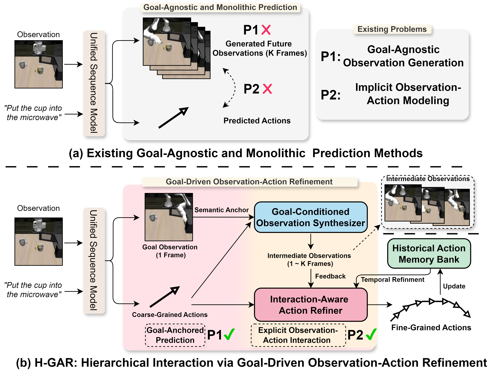

<div align="center">
<h2 class="papername"> H-GAR: A Hierarchical Interaction Framework via Goal-Driven
 Observation-Action Refinement for Robotic Manipulation </h2>
<div>
    <a href="https://scholar.google.com.hk/citations?user=0GtAUPoAAAAJ&hl=zh-CN&oi=sra" target="_blank">Yijie Zhu</a><sup>1,2</sup>,
    <a href="https://rshaojimmy.github.io/OrionLab/" target="_blank">Rui Shao*</a><sup>1,3</sup>,
    <a href="https://github.com/airplane312" target="_blank">Ziyang Liu</a><sup>1</sup>,
    <a href="https://orcid.org/0009-0001-9102-7051" target="_blank">Jie He</a><sup>1</sup>,
    <a href="https://github.com/Danielement321" target="_blank">Jizhihui Liu</a><sup>1</sup>,
   <a href="https://xxxy.lyu.edu.cn/2023/0831/c2154a217175/page.htm" target="_blank">Jiuru Wang</a><sup>4</sup>,
    <a href="https://zitongyu.github.io/" target="_blank">Zitong Yu*</a><sup>2,5</sup>, 
</div>
<sup>1</sup>School of Computer Science and Technology, Harbin Institute of Technology, Shenzhen<br>
<sup>2</sup>Great Bay University
<sup>3</sup>Shenzhen Loop Area Institute
<sup>4</sup>Linyi University<br>
<sup>5</sup>Dongguan Key Laboratory for Intelligence and Information Technology<br>
*Corresponding author<br>

[](https://arxiv.org/abs/2511.17079)

 <h3 align="center">
<strong>
🔥H-GAR is accepted to AAAI 2026 <span style="color:#C00000;">Oral</span>!🔥
<br>
⭐ Give us a star if you like it! ⭐
<br>
✨If you find this work useful for your research, please kindly cite our paper.✨
</strong>
</h3>
</div>

</div>


## :fire: Updates
- [11/2025] :fire: The code is released. Enjoy it!
- [11/2025] :fire: [arXiv paper](https://arxiv.org/abs/2511.17079) released!
- [11/2025] H-GAR has been accepted by AAAI 2026 as oral!

## :fire: Introduction

This is the github repository of *H-GAR: A Hierarchical Interaction Framework via Goal-Driven
 Observation-Action Refinement for Robotic Manipulation*. 
The framework first generates the coarse action and goal observation, which serve as high-level guides for the task. Then, two synergistic modules—Goal-Conditioned Observation Synthesizer (GOS) and Interaction-Aware Action Refiner (IAAR)—refine the actions by incorporating feedback from intermediate observations and leveraging a Historical Action Memory Bank to ensure temporal consistency.
The comparison of existing works:
<div align="center">

</div>

The whole framework of H-GAR:

<div align="center">

</div>

## 🛠️ Installation
Install the conda environment:
```console
$ conda install mamba -c conda-forge
```
```console
$ mamba env create -f conda_environment.yml
```
### Training

#### Download Pretrained Models
We start from a pretrained VAE model and a pretrained image generation model [MAR](https://github.com/LTH14/mar). Run the following command to download the pretrained models.
```
python h_gar/utils/download.py
```
The Model weights and Training codes are coming soon ...
### Testing

```
CUDA_VISIBLE_DEVICES=0 python eval_sim.py --checkpoint checkpoints/pusht.ckpt --output_dir checkpoints/pusht
```

```
CUDA_VISIBLE_DEVICES=0 python eval_sim.py --checkpoint checkpoints/pusht_multitask.ckpt --output_dir checkpoints/pusht_multitask
```

```
CUDA_VISIBLE_DEVICES=0 python eval_sim.py --checkpoint checkpoints/libero10.ckpt --output_dir checkpoints/libero10
```
## Videos

https://github.com/user-attachments/assets/c47280c7-0698-490e-8ee0-79980ae299fb


https://github.com/user-attachments/assets/3b42abc9-be44-42ef-b8f3-bb0efc128538

## :fire: Details will be released. Stay tuned.

## :pencil: Citation
If you find this work useful for your research, please kindly cite our paper.

```
@inproceedings{zhu2026H-GAR,
  title={H-GAR: A Hierarchical Interaction Framework via Goal-Driven Observation-Action Refinement for Robotic Manipulation},
  author={Zhu, Yijie and Shao, Rui and Liu, Ziyang and He, Jie and Liu, Jizhihui and Wang, Jiuru and Yu, Zitong},
  booktitle={Proceedings of the AAAI Conference on Artificial Intelligence},
  year={2026}
}
```
## Acknowledgement
* Lots of code are inherited from [UVA](https://github.com/ShuangLI59/unified_video_action/tree/main) and [MAR](https://github.com/LTH14/mar).
